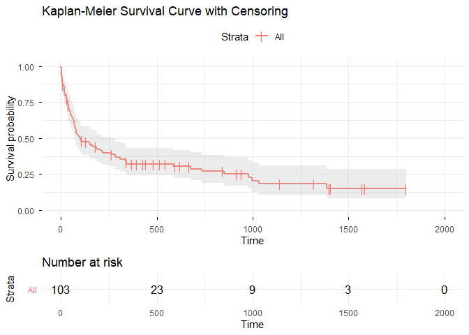
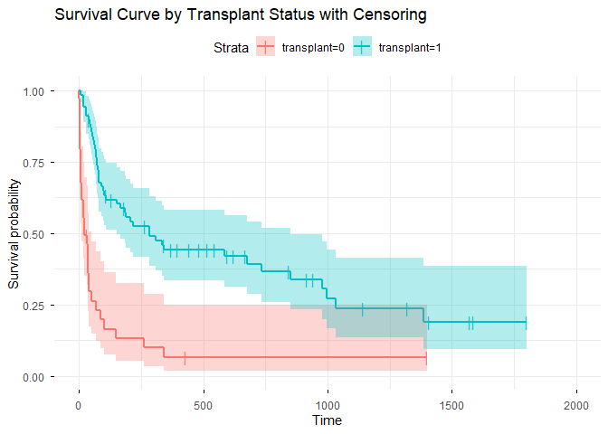
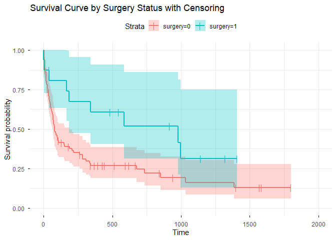
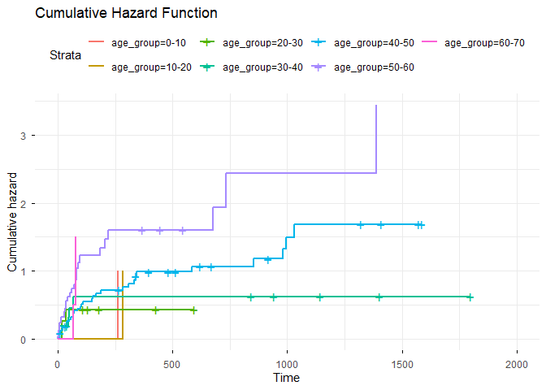
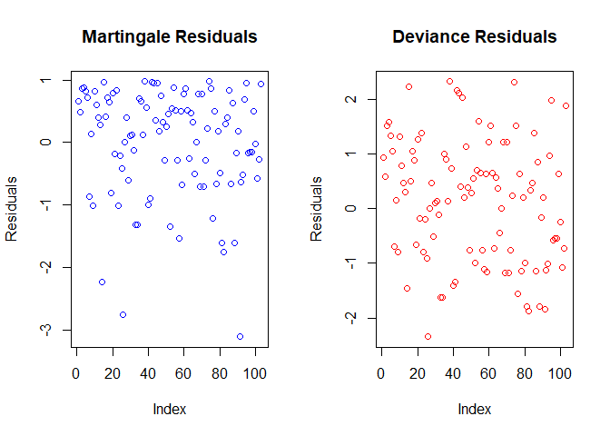
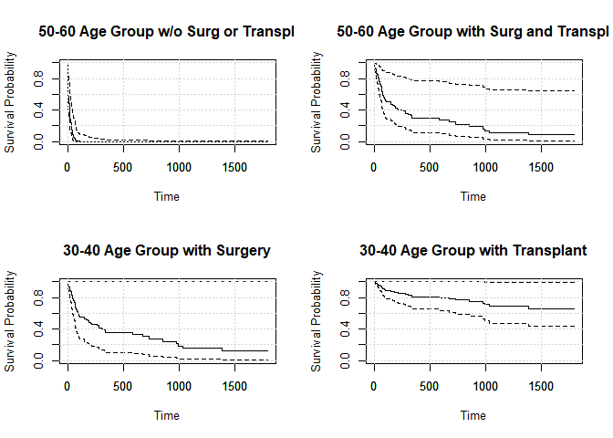

Survival Analysis
================
Data ScienceTech Institute, 2024

Contributors: Amit Agarwal, Lorena Romeo, Nicolas Len, Quentin Camilleri

Data set: Survival of patients awaiting transplant in the Jasa heart
data of the survival package.

# Objective:

Assess the effect on survival of transplantation, treating the patient
population as homogeneous, while in the influence of a number of
covariates was investigated through pairwise correlations and explore
techniques to see the simultaneous effect of several covariates and see
for what values of these covariates, if any, transplantation or surgery
is likely to prolong survival.

# Load Libraries

``` r
invisible(lapply(c("dplyr", "tidyr", "ggplot2", "magrittr", "lubridate", "BSDA",
        "tidyverse","broom", "xtable", "webr", "gtsummary","modelsummary", 
        "epiDisplay", "mgcv", "survival", "ggfortify", "gridExtra", "survminer", 
        "epiR", "swimplot", "muhaz", "asaur", "maxLik", "survivalROC", "plyr", 
        "glmnet", "tidycmprsk", "mstate", "cmprsk", "timeROC", "survAUC", 
        "tidycmprsk","openxlsx","VSURF", "Hmisc","pec","riskRegression","car"),
        library, character.only = TRUE))
```

# Datasets

Three dataset are available. 1. jasa, the original data with 103
observations 2. heart (the main data set) with 172 observations 3.
stanford2 (Stanford Heart Transplant data in a different format) with
184 observations (ignored as the number of subjects are not the same).
jasa, jasa1, heart, all have 103 subjects while stanford2 has 184
subjects. id and subject are the same. actual_age = accept.dt - birth.dt
futime = fu.date - accept.dt wait.time = tx.date - accept.dt stop =
fu.date - accept.dt + 1 = end of followup - acceptance into program + 1
wait.time = tx.date - accept.dt + 1 = transplant date - acceptance into
program + 1 (stop - start) time between the events. event = fustat =
death of patient

We use jasa data, that is the most complete, and extract relevant
columns.

``` r
# Load the datasets
jasa_data <- jasa
colnames(jasa_data)[colnames(jasa_data) == "age"] <- "actual_age"
jasa_data <- cbind(id = 1:103, jasa_data)
jasa_data$age <- jasa_data$actual_age - 48
jasa_data$stop <- as.numeric(jasa_data$fu.date - jasa_data$accept.dt + 1)
jasa_data$age_group <- cut(jasa_data$actual_age, breaks = seq(0, 80, 10),
                      labels = c("0-10", "10-20", "20-30", "30-40", "40-50",
                                 "50-60", "60-70", "70-80"))
jasa_data$duration_e_1 <- as.numeric(jasa_data$fu.date - jasa_data$accept.dt) / 365.25
```

``` r
# Check for censoring in the dataset
jasa_data$censored <- ifelse(jasa_data$fustat == 0, TRUE, FALSE)
print(table(jasa_data$censored))
```

    ## 
    ## FALSE  TRUE 
    ##    75    28

75 observations are not censored, i.e. death has occurred within the end
of the study. 28 subjects are censored, i.e. the event has not occurred
by the end of the study period.

``` r
data_uncensored <- jasa_data %>% filter(fustat == 1)
jasa_data$event <- ifelse(jasa_data$censored, 0, 1)

# Removing specified redundant or useless covariates 
jasa_data <- dplyr::select(jasa_data, -fustat, -mismatch, -hla.a2, -mscore, -reject)
#str(jasa_data) #commented out to reduce pages
#'data.frame':  103 obs. of  16 variables:
#id, birth.dt, accept.dt, tx.date, fu.date, surgery, actual_age, futime, wait.time, transplant, 
#age, stop, age_group, duration_e_1, censored, event  
```

``` r
surv_object <- Surv(time = jasa_data$stop, event = jasa_data$event)
```

# Modelling: Survival and Hazard Curves

Survival: without considering grouping or stratification based on other
variables

``` r
# Kaplan-Meier estimator
km_fit <- survfit(surv_object ~ 1,data=jasa_data)
km_summary <- summary(km_fit)
print(paste("survival probabilities: ", min(km_summary$surv)))
```

    ## [1] "survival probabilities:  0.151912117361313"

``` r
print(paste("survival times: ", max(km_summary$time)))
```

    ## [1] "survival times:  1387"

We can see that over time, the probability of survival steadily
declines, in fact we see that after 1387 days of study (~3.8 years) only
15.2% of the individuals are expected to survive beyond this.

``` r
ggsurvplot(km_fit, conf.int = TRUE, risk.table=TRUE, ggtheme = theme_minimal(), 
      title = "Kaplan-Meier Survival Curve with Censoring", censor.shape = '|', 
      censor.size = 4)
```

    ## Warning: Using `size` aesthetic for lines was deprecated in ggplot2 3.4.0.
    ## ℹ Please use `linewidth` instead.
    ## ℹ The deprecated feature was likely used in the ggpubr package.
    ##   Please report the issue at <https://github.com/kassambara/ggpubr/issues>.
    ## This warning is displayed once per session.
    ## Call `lifecycle::last_lifecycle_warnings()` to see where this warning was
    ## generated.

    ## Ignoring unknown labels:
    ## • fill : "Strata"
    ## Ignoring unknown labels:
    ## • fill : "Strata"
    ## Ignoring unknown labels:
    ## • fill : "Strata"
    ## Ignoring unknown labels:
    ## • fill : "Strata"
    ## Ignoring unknown labels:
    ## • colour : "Strata"

<!-- -->

The survival plot confirms that the probability of survival decreases
over time. Initially, the survival probability drops sharply and then
continues to decline at a slower rate as time progresses.

By the end of the observation period, the survival probability is quite
low, indicating that most participants either experienced the event or
were censored.

## Survival: Grouping and Stratification modelling

### Kaplan-Meier estimator stratified by transplant status

``` r
km_fit_transplant <- survfit(surv_object ~ transplant, data = jasa_data)
#summary(km_fit_transplant) # commented out to reduce the pages
ggsurvplot(km_fit_transplant, conf.int = TRUE, ggtheme = theme_minimal(),
           title = "Survival Curve by Transplant Status with Censoring", 
           censor.shape = '|', censor.size = 4)
```

<!-- -->
By the end of the study only 19% of individuals who received a
transplant were still alive compared to only 6.5% of those who did not
receive a transplant.

The survival curve for transplanted patients declines more gradually,
indicating that they experienced better longevity compared to those who
did not receive a transplant.

### Kaplan-Meier estimator stratified by surgery

``` r
km_fit_surgery <- survfit(surv_object ~ surgery, data = jasa_data)
#summary(km_fit_surgery) #commented out to reduce the pages
ggsurvplot(km_fit_surgery, conf.int = TRUE, ggtheme = theme_minimal(), 
           title = "Survival Curve by Surgery Status with Censoring",
           censor.shape = '|', censor.size = 4)
```

<!-- -->
Stratifying by surgery status reveals that by the end of the study,
approximately 13% of individuals who did not undergo surgery were still
alive, compared to ~31% of those who had surgery.

Additionally, the plot shows that the survival curve for patients who
had surgery declines more gradually and maintains a higher survival rate
over time. This analysis suggests that surgery positively impacts
patient survival.

## Hazard: based on risk groups

### Cumulative hazard function using Nelson-Aalen estimator by age-group

``` r
na_fit_age <- survfit(Surv(stop, event) ~ age_group, 
                      data = jasa_data, type = "fleming-harrington")

#summary(na_fit_age) # commented out to reduce the pages
summary(na_fit_age)$table # See results for breakdown by age groups
```

    ##                 records n.max n.start events     rmean se(rmean) median 0.95LCL
    ## age_group=0-10        1     1       1      1  828.4307   0.00000    263     263
    ## age_group=10-20       1     1       1      1  842.3374   0.00000    285     285
    ## age_group=20-30       8     8       8      3 1173.9715 314.99539     NA      36
    ## age_group=30-40      11    11      11      5  979.7527 290.85939     NA      50
    ## age_group=40-50      48    48      48     34  574.7142 108.57838    188     100
    ## age_group=50-60      32    32      32     29  260.1087  95.43696     61      32
    ## age_group=60-70       2     2       2      2  457.1251 276.56721     77      66
    ##                 0.95UCL
    ## age_group=0-10       NA
    ## age_group=10-20      NA
    ## age_group=20-30      NA
    ## age_group=30-40      NA
    ## age_group=40-50     852
    ## age_group=50-60     186
    ## age_group=60-70      NA

In the above summary we note that the age-group 50-60 has the highest
risk of experiencing the event, in fact the survival rate is only ~3%
during the study period. While the age-group 20-30 has the lowest risk,
with a survival rate of ~65%.

``` r
ggsurvplot(na_fit_age, fun = "cumhaz", ggtheme = theme_minimal(),
           title = "Cumulative Hazard Function")
```

<!-- -->

The plot shows that Age group 50-60 (purple) exhibits the highest risk.
Age group 20-30 (green) has the lowest cumulative hazard even if we do
not have complete data on the long run. The cumulative hazard increases
over time for most age groups, but at different rates. This suggests
that the risk of the event increases as time progresses, but it is not
uniform across age groups. Therefore we conclude that the hazard risk is
likely to be impacted by the age of the patient.

# Tests to compare Survival distribution between groups

### Stratified Log-rank test on transplant+surgery

``` r
stratified_logrank <- survdiff(surv_object ~ transplant + strata(surgery), 
                               data = jasa_data)
print(paste("Log-rank test for transplant + surgery : ", stratified_logrank))
```

    ## [1] "Log-rank test for transplant + surgery :  c(`transplant=0` = 34, `transplant=1` = 69)"                                     
    ## [2] "Log-rank test for transplant + surgery :  c(27, 39, 3, 6)"                                                                 
    ## [3] "Log-rank test for transplant + surgery :  c(12.9687343286493, 53.0312656713507, 0.39775641025641, 8.60224358974359)"       
    ## [4] "Log-rank test for transplant + surgery :  c(10.3597418346794, -10.3597418346794, -10.3597418346794, 10.3597418346794)"     
    ## [5] "Log-rank test for transplant + surgery :  26.7066143880863"                                                                
    ## [6] "Log-rank test for transplant + surgery :  2.36809494670142e-07"                                                            
    ## [7] "Log-rank test for transplant + surgery :  c(`surgery=0` = 87, `surgery=1` = 16)"                                           
    ## [8] "Log-rank test for transplant + surgery :  survdiff(formula = surv_object ~ transplant + strata(surgery), data = jasa_data)"

The chi-square \[5\] is quite high, therefore suggesting a stronger
difference in survival between the groups. The p-value, indicator \[6\],
associated to the chi-square test statistic is very small, indicating
that the observed differences in survival between the groups are highly
statistically significant. This suggests strong evidence against the
null hypothesis of no difference in survival.

### Log-rank test on transplant vs. no transplant

``` r
logrank_test_transplant <- survdiff(surv_object ~ transplant, data = jasa_data)
print(paste("Log-rank test for transplant: ", logrank_test_transplant))
```

    ## [1] "Log-rank test for transplant:  c(`transplant=0` = 34, `transplant=1` = 69)"                                
    ## [2] "Log-rank test for transplant:  c(30, 45)"                                                                  
    ## [3] "Log-rank test for transplant:  c(12.091021143621, 62.908978856379)"                                        
    ## [4] "Log-rank test for transplant:  c(9.64838436230081, -9.64838436230081, -9.64838436230081, 9.64838436230081)"
    ## [5] "Log-rank test for transplant:  33.2419928181372"                                                           
    ## [6] "Log-rank test for transplant:  8.13741373144396e-09"                                                       
    ## [7] "Log-rank test for transplant:  survdiff(formula = surv_object ~ transplant, data = jasa_data)"

The small p-value indicates that the transplant has a highly significant
impact on survival. Thus, receiving a transplant affects survival times.
The high chi-square value (33.24) further supports the significant
effect.

### Log-rank test on surgery vs. no surgery

``` r
logrank_test_surgery <- survdiff(surv_object ~ surgery, data = jasa_data)
print(paste("Log-rank test for surgery: ",logrank_test_surgery))
```

    ## [1] "Log-rank test for surgery:  c(`surgery=0` = 87, `surgery=1` = 16)"                                      
    ## [2] "Log-rank test for surgery:  c(66, 9)"                                                                   
    ## [3] "Log-rank test for surgery:  c(58.5875940157749, 16.4124059842251)"                                      
    ## [4] "Log-rank test for surgery:  c(12.3658501352826, -12.3658501352826, -12.3658501352826, 12.3658501352826)"
    ## [5] "Log-rank test for surgery:  4.4431852136238"                                                            
    ## [6] "Log-rank test for surgery:  0.0350408140477288"                                                         
    ## [7] "Log-rank test for surgery:  survdiff(formula = surv_object ~ surgery, data = jasa_data)"

The chi-square statistic (4.443) and the p-value (0.035) suggest that
there is a statistically significant difference between the survival
curves of the two groups surgery and not surgery. The low p-value
indicates that the difference in survival between surgery and
non-surgery groups is significant, but less significant than the
transplant group.

### Log-rank test on age_groups

``` r
logrank_test_age <- survdiff(surv_object ~ age_group, data = jasa_data)
print(paste("Log-rank test for age groups: ",logrank_test_age))
```

    ## [1] "Log-rank test for age groups:  c(`age_group=0-10` = 1, `age_group=10-20` = 1, `age_group=20-30` = 8, `age_group=30-40` = 11, `age_group=40-50` = 48, `age_group=50-60` = 32, `age_group=60-70` = 2)"                                                                                                                                                                                                                                                                                                                                                                                                                                                                                                                                                                                                                                                                                                                                                                                                                                          
    ## [2] "Log-rank test for age groups:  c(1, 1, 3, 5, 34, 29, 2)"                                                                                                                                                                                                                                                                                                                                                                                                                                                                                                                                                                                                                                                                                                                                                                                                                                                                                                                                                                                      
    ## [3] "Log-rank test for age groups:  c(0.936259415948052, 0.993402273090909, 5.2401479103105, 9.75279429838162, 39.5726408080367, 17.4736596990747, 1.03109559515754)"                                                                                                                                                                                                                                                                                                                                                                                                                                                                                                                                                                                                                                                                                                                                                                                                                                                                              
    ## [4] "Log-rank test for age groups:  c(0.916346052775715, -0.0156823759628872, -0.0723331922130203, -0.0993992897026912, -0.490725775493497, -0.224949401710104, -0.0132560176935162, -0.0156823759628872, 0.970223603796124, -0.0755024599201032, -0.107322458970398, -0.524003086417867, -0.234457204831353, -0.0132560176935162, -0.0723331922130203, -0.0755024599201032, 4.79565752612084, -0.569917870003763, -2.70850376064568, -1.28836542419102, -0.081034819147249, -0.0993992897026912, -0.107322458970398, -0.569917870003763, 8.16893934692461, \n-5.20832063365711, -2.07651372612089, -0.107465368469759, -0.490725775493497, -0.524003086417867, -2.70850376064568, -5.20832063365711, 18.4386628573733, -8.99863570111134, -0.508473900047858, -0.224949401710104, -0.234457204831353, -1.28836542419102, -2.07651372612089, -8.99863570111134, 13.0983321628675, -0.275410704902819, -0.0132560176935162, -0.0132560176935162, -0.081034819147249, -0.107465368469759, -0.508473900047858, -0.275410704902819, 0.998896827954718)"
    ## [5] "Log-rank test for age groups:  12.9962514916591"                                                                                                                                                                                                                                                                                                                                                                                                                                                                                                                                                                                                                                                                                                                                                                                                                                                                                                                                                                                              
    ## [6] "Log-rank test for age groups:  0.0430955121328494"                                                                                                                                                                                                                                                                                                                                                                                                                                                                                                                                                                                                                                                                                                                                                                                                                                                                                                                                                                                            
    ## [7] "Log-rank test for age groups:  survdiff(formula = surv_object ~ age_group, data = jasa_data)"

The chi-square statistic (12.996) and the p-value (0.043) suggest
statistically significant difference between the survival curves of the
age-groups. The low p-value indicates that the difference in survival
between the age-groups is significant, but less significant than the
transplant group.

Our conclusion is that all groups are significantly impacting the
survival rate but the transplant is the most impactful.

### Cox proportional hazards model

To understand how various covariates influence survival time

``` r
cox_model <- coxph(surv_object ~ age_group+surgery+transplant,data = jasa_data)
tbl_regression(cox_model)
```

<div id="kbjydcnzuf" style="padding-left:0px;padding-right:0px;padding-top:10px;padding-bottom:10px;overflow-x:auto;overflow-y:auto;width:auto;height:auto;">
<style>#kbjydcnzuf table {
  font-family: system-ui, 'Segoe UI', Roboto, Helvetica, Arial, sans-serif, 'Apple Color Emoji', 'Segoe UI Emoji', 'Segoe UI Symbol', 'Noto Color Emoji';
  -webkit-font-smoothing: antialiased;
  -moz-osx-font-smoothing: grayscale;
}
&#10;#kbjydcnzuf thead, #kbjydcnzuf tbody, #kbjydcnzuf tfoot, #kbjydcnzuf tr, #kbjydcnzuf td, #kbjydcnzuf th {
  border-style: none;
}
&#10;#kbjydcnzuf p {
  margin: 0;
  padding: 0;
}
&#10;#kbjydcnzuf .gt_table {
  display: table;
  border-collapse: collapse;
  line-height: normal;
  margin-left: auto;
  margin-right: auto;
  color: #333333;
  font-size: 16px;
  font-weight: normal;
  font-style: normal;
  background-color: #FFFFFF;
  width: auto;
  border-top-style: solid;
  border-top-width: 2px;
  border-top-color: #A8A8A8;
  border-right-style: none;
  border-right-width: 2px;
  border-right-color: #D3D3D3;
  border-bottom-style: solid;
  border-bottom-width: 2px;
  border-bottom-color: #A8A8A8;
  border-left-style: none;
  border-left-width: 2px;
  border-left-color: #D3D3D3;
}
&#10;#kbjydcnzuf .gt_caption {
  padding-top: 4px;
  padding-bottom: 4px;
}
&#10;#kbjydcnzuf .gt_title {
  color: #333333;
  font-size: 125%;
  font-weight: initial;
  padding-top: 4px;
  padding-bottom: 4px;
  padding-left: 5px;
  padding-right: 5px;
  border-bottom-color: #FFFFFF;
  border-bottom-width: 0;
}
&#10;#kbjydcnzuf .gt_subtitle {
  color: #333333;
  font-size: 85%;
  font-weight: initial;
  padding-top: 3px;
  padding-bottom: 5px;
  padding-left: 5px;
  padding-right: 5px;
  border-top-color: #FFFFFF;
  border-top-width: 0;
}
&#10;#kbjydcnzuf .gt_heading {
  background-color: #FFFFFF;
  text-align: center;
  border-bottom-color: #FFFFFF;
  border-left-style: none;
  border-left-width: 1px;
  border-left-color: #D3D3D3;
  border-right-style: none;
  border-right-width: 1px;
  border-right-color: #D3D3D3;
}
&#10;#kbjydcnzuf .gt_bottom_border {
  border-bottom-style: solid;
  border-bottom-width: 2px;
  border-bottom-color: #D3D3D3;
}
&#10;#kbjydcnzuf .gt_col_headings {
  border-top-style: solid;
  border-top-width: 2px;
  border-top-color: #D3D3D3;
  border-bottom-style: solid;
  border-bottom-width: 2px;
  border-bottom-color: #D3D3D3;
  border-left-style: none;
  border-left-width: 1px;
  border-left-color: #D3D3D3;
  border-right-style: none;
  border-right-width: 1px;
  border-right-color: #D3D3D3;
}
&#10;#kbjydcnzuf .gt_col_heading {
  color: #333333;
  background-color: #FFFFFF;
  font-size: 100%;
  font-weight: normal;
  text-transform: inherit;
  border-left-style: none;
  border-left-width: 1px;
  border-left-color: #D3D3D3;
  border-right-style: none;
  border-right-width: 1px;
  border-right-color: #D3D3D3;
  vertical-align: bottom;
  padding-top: 5px;
  padding-bottom: 6px;
  padding-left: 5px;
  padding-right: 5px;
  overflow-x: hidden;
}
&#10;#kbjydcnzuf .gt_column_spanner_outer {
  color: #333333;
  background-color: #FFFFFF;
  font-size: 100%;
  font-weight: normal;
  text-transform: inherit;
  padding-top: 0;
  padding-bottom: 0;
  padding-left: 4px;
  padding-right: 4px;
}
&#10;#kbjydcnzuf .gt_column_spanner_outer:first-child {
  padding-left: 0;
}
&#10;#kbjydcnzuf .gt_column_spanner_outer:last-child {
  padding-right: 0;
}
&#10;#kbjydcnzuf .gt_column_spanner {
  border-bottom-style: solid;
  border-bottom-width: 2px;
  border-bottom-color: #D3D3D3;
  vertical-align: bottom;
  padding-top: 5px;
  padding-bottom: 5px;
  overflow-x: hidden;
  display: inline-block;
  width: 100%;
}
&#10;#kbjydcnzuf .gt_spanner_row {
  border-bottom-style: hidden;
}
&#10;#kbjydcnzuf .gt_group_heading {
  padding-top: 8px;
  padding-bottom: 8px;
  padding-left: 5px;
  padding-right: 5px;
  color: #333333;
  background-color: #FFFFFF;
  font-size: 100%;
  font-weight: initial;
  text-transform: inherit;
  border-top-style: solid;
  border-top-width: 2px;
  border-top-color: #D3D3D3;
  border-bottom-style: solid;
  border-bottom-width: 2px;
  border-bottom-color: #D3D3D3;
  border-left-style: none;
  border-left-width: 1px;
  border-left-color: #D3D3D3;
  border-right-style: none;
  border-right-width: 1px;
  border-right-color: #D3D3D3;
  vertical-align: middle;
  text-align: left;
}
&#10;#kbjydcnzuf .gt_empty_group_heading {
  padding: 0.5px;
  color: #333333;
  background-color: #FFFFFF;
  font-size: 100%;
  font-weight: initial;
  border-top-style: solid;
  border-top-width: 2px;
  border-top-color: #D3D3D3;
  border-bottom-style: solid;
  border-bottom-width: 2px;
  border-bottom-color: #D3D3D3;
  vertical-align: middle;
}
&#10;#kbjydcnzuf .gt_from_md > :first-child {
  margin-top: 0;
}
&#10;#kbjydcnzuf .gt_from_md > :last-child {
  margin-bottom: 0;
}
&#10;#kbjydcnzuf .gt_row {
  padding-top: 8px;
  padding-bottom: 8px;
  padding-left: 5px;
  padding-right: 5px;
  margin: 10px;
  border-top-style: solid;
  border-top-width: 1px;
  border-top-color: #D3D3D3;
  border-left-style: none;
  border-left-width: 1px;
  border-left-color: #D3D3D3;
  border-right-style: none;
  border-right-width: 1px;
  border-right-color: #D3D3D3;
  vertical-align: middle;
  overflow-x: hidden;
}
&#10;#kbjydcnzuf .gt_stub {
  color: #333333;
  background-color: #FFFFFF;
  font-size: 100%;
  font-weight: initial;
  text-transform: inherit;
  border-right-style: solid;
  border-right-width: 2px;
  border-right-color: #D3D3D3;
  padding-left: 5px;
  padding-right: 5px;
}
&#10;#kbjydcnzuf .gt_stub_row_group {
  color: #333333;
  background-color: #FFFFFF;
  font-size: 100%;
  font-weight: initial;
  text-transform: inherit;
  border-right-style: solid;
  border-right-width: 2px;
  border-right-color: #D3D3D3;
  padding-left: 5px;
  padding-right: 5px;
  vertical-align: top;
}
&#10;#kbjydcnzuf .gt_row_group_first td {
  border-top-width: 2px;
}
&#10;#kbjydcnzuf .gt_row_group_first th {
  border-top-width: 2px;
}
&#10;#kbjydcnzuf .gt_summary_row {
  color: #333333;
  background-color: #FFFFFF;
  text-transform: inherit;
  padding-top: 8px;
  padding-bottom: 8px;
  padding-left: 5px;
  padding-right: 5px;
}
&#10;#kbjydcnzuf .gt_first_summary_row {
  border-top-style: solid;
  border-top-color: #D3D3D3;
}
&#10;#kbjydcnzuf .gt_first_summary_row.thick {
  border-top-width: 2px;
}
&#10;#kbjydcnzuf .gt_last_summary_row {
  padding-top: 8px;
  padding-bottom: 8px;
  padding-left: 5px;
  padding-right: 5px;
  border-bottom-style: solid;
  border-bottom-width: 2px;
  border-bottom-color: #D3D3D3;
}
&#10;#kbjydcnzuf .gt_grand_summary_row {
  color: #333333;
  background-color: #FFFFFF;
  text-transform: inherit;
  padding-top: 8px;
  padding-bottom: 8px;
  padding-left: 5px;
  padding-right: 5px;
}
&#10;#kbjydcnzuf .gt_first_grand_summary_row {
  padding-top: 8px;
  padding-bottom: 8px;
  padding-left: 5px;
  padding-right: 5px;
  border-top-style: double;
  border-top-width: 6px;
  border-top-color: #D3D3D3;
}
&#10;#kbjydcnzuf .gt_last_grand_summary_row_top {
  padding-top: 8px;
  padding-bottom: 8px;
  padding-left: 5px;
  padding-right: 5px;
  border-bottom-style: double;
  border-bottom-width: 6px;
  border-bottom-color: #D3D3D3;
}
&#10;#kbjydcnzuf .gt_striped {
  background-color: rgba(128, 128, 128, 0.05);
}
&#10;#kbjydcnzuf .gt_table_body {
  border-top-style: solid;
  border-top-width: 2px;
  border-top-color: #D3D3D3;
  border-bottom-style: solid;
  border-bottom-width: 2px;
  border-bottom-color: #D3D3D3;
}
&#10;#kbjydcnzuf .gt_footnotes {
  color: #333333;
  background-color: #FFFFFF;
  border-bottom-style: none;
  border-bottom-width: 2px;
  border-bottom-color: #D3D3D3;
  border-left-style: none;
  border-left-width: 2px;
  border-left-color: #D3D3D3;
  border-right-style: none;
  border-right-width: 2px;
  border-right-color: #D3D3D3;
}
&#10;#kbjydcnzuf .gt_footnote {
  margin: 0px;
  font-size: 90%;
  padding-top: 4px;
  padding-bottom: 4px;
  padding-left: 5px;
  padding-right: 5px;
}
&#10;#kbjydcnzuf .gt_sourcenotes {
  color: #333333;
  background-color: #FFFFFF;
  border-bottom-style: none;
  border-bottom-width: 2px;
  border-bottom-color: #D3D3D3;
  border-left-style: none;
  border-left-width: 2px;
  border-left-color: #D3D3D3;
  border-right-style: none;
  border-right-width: 2px;
  border-right-color: #D3D3D3;
}
&#10;#kbjydcnzuf .gt_sourcenote {
  font-size: 90%;
  padding-top: 4px;
  padding-bottom: 4px;
  padding-left: 5px;
  padding-right: 5px;
}
&#10;#kbjydcnzuf .gt_left {
  text-align: left;
}
&#10;#kbjydcnzuf .gt_center {
  text-align: center;
}
&#10;#kbjydcnzuf .gt_right {
  text-align: right;
  font-variant-numeric: tabular-nums;
}
&#10;#kbjydcnzuf .gt_font_normal {
  font-weight: normal;
}
&#10;#kbjydcnzuf .gt_font_bold {
  font-weight: bold;
}
&#10;#kbjydcnzuf .gt_font_italic {
  font-style: italic;
}
&#10;#kbjydcnzuf .gt_super {
  font-size: 65%;
}
&#10;#kbjydcnzuf .gt_footnote_marks {
  font-size: 75%;
  vertical-align: 0.4em;
  position: initial;
}
&#10;#kbjydcnzuf .gt_asterisk {
  font-size: 100%;
  vertical-align: 0;
}
&#10;#kbjydcnzuf .gt_indent_1 {
  text-indent: 5px;
}
&#10;#kbjydcnzuf .gt_indent_2 {
  text-indent: 10px;
}
&#10;#kbjydcnzuf .gt_indent_3 {
  text-indent: 15px;
}
&#10;#kbjydcnzuf .gt_indent_4 {
  text-indent: 20px;
}
&#10;#kbjydcnzuf .gt_indent_5 {
  text-indent: 25px;
}
&#10;#kbjydcnzuf .katex-display {
  display: inline-flex !important;
  margin-bottom: 0.75em !important;
}
&#10;#kbjydcnzuf div.Reactable > div.rt-table > div.rt-thead > div.rt-tr.rt-tr-group-header > div.rt-th-group:after {
  height: 0px !important;
}
</style>
<table class="gt_table" data-quarto-disable-processing="false" data-quarto-bootstrap="false">
  <thead>
    <tr class="gt_col_headings">
      <th class="gt_col_heading gt_columns_bottom_border gt_left" rowspan="1" colspan="1" scope="col" id="label"><span class='gt_from_md'><strong>Characteristic</strong></span></th>
      <th class="gt_col_heading gt_columns_bottom_border gt_center" rowspan="1" colspan="1" scope="col" id="estimate"><span class='gt_from_md'><strong>log(HR)</strong></span></th>
      <th class="gt_col_heading gt_columns_bottom_border gt_center" rowspan="1" colspan="1" scope="col" id="conf.low"><span class='gt_from_md'><strong>95% CI</strong></span></th>
      <th class="gt_col_heading gt_columns_bottom_border gt_center" rowspan="1" colspan="1" scope="col" id="p.value"><span class='gt_from_md'><strong>p-value</strong></span></th>
    </tr>
  </thead>
  <tbody class="gt_table_body">
    <tr><td headers="label" class="gt_row gt_left">age_group</td>
<td headers="estimate" class="gt_row gt_center"><br /></td>
<td headers="conf.low" class="gt_row gt_center"><br /></td>
<td headers="p.value" class="gt_row gt_center"><br /></td></tr>
    <tr><td headers="label" class="gt_row gt_left">    0-10</td>
<td headers="estimate" class="gt_row gt_center">—</td>
<td headers="conf.low" class="gt_row gt_center">—</td>
<td headers="p.value" class="gt_row gt_center"><br /></td></tr>
    <tr><td headers="label" class="gt_row gt_left">    10-20</td>
<td headers="estimate" class="gt_row gt_center">1.8</td>
<td headers="conf.low" class="gt_row gt_center">-1.0, 4.7</td>
<td headers="p.value" class="gt_row gt_center">0.2</td></tr>
    <tr><td headers="label" class="gt_row gt_left">    20-30</td>
<td headers="estimate" class="gt_row gt_center">0.32</td>
<td headers="conf.low" class="gt_row gt_center">-2.0, 2.6</td>
<td headers="p.value" class="gt_row gt_center">0.8</td></tr>
    <tr><td headers="label" class="gt_row gt_left">    30-40</td>
<td headers="estimate" class="gt_row gt_center">0.07</td>
<td headers="conf.low" class="gt_row gt_center">-2.1, 2.2</td>
<td headers="p.value" class="gt_row gt_center">>0.9</td></tr>
    <tr><td headers="label" class="gt_row gt_left">    40-50</td>
<td headers="estimate" class="gt_row gt_center">1.2</td>
<td headers="conf.low" class="gt_row gt_center">-0.81, 3.2</td>
<td headers="p.value" class="gt_row gt_center">0.2</td></tr>
    <tr><td headers="label" class="gt_row gt_left">    50-60</td>
<td headers="estimate" class="gt_row gt_center">2.1</td>
<td headers="conf.low" class="gt_row gt_center">0.06, 4.2</td>
<td headers="p.value" class="gt_row gt_center">0.044</td></tr>
    <tr><td headers="label" class="gt_row gt_left">    60-70</td>
<td headers="estimate" class="gt_row gt_center">2.7</td>
<td headers="conf.low" class="gt_row gt_center">0.17, 5.2</td>
<td headers="p.value" class="gt_row gt_center">0.036</td></tr>
    <tr><td headers="label" class="gt_row gt_left">    70-80</td>
<td headers="estimate" class="gt_row gt_center"><br /></td>
<td headers="conf.low" class="gt_row gt_center"><br /></td>
<td headers="p.value" class="gt_row gt_center"><br /></td></tr>
    <tr><td headers="label" class="gt_row gt_left">surgery</td>
<td headers="estimate" class="gt_row gt_center">-0.28</td>
<td headers="conf.low" class="gt_row gt_center">-1.0, 0.46</td>
<td headers="p.value" class="gt_row gt_center">0.5</td></tr>
    <tr><td headers="label" class="gt_row gt_left">transplant</td>
<td headers="estimate" class="gt_row gt_center">-1.9</td>
<td headers="conf.low" class="gt_row gt_center">-2.5, -1.3</td>
<td headers="p.value" class="gt_row gt_center"><0.001</td></tr>
  </tbody>
  <tfoot>
    <tr class="gt_sourcenotes">
      <td class="gt_sourcenote" colspan="4"><span class='gt_from_md'>Abbreviations: CI = Confidence Interval, HR = Hazard Ratio</span></td>
    </tr>
  </tfoot>
</table>
</div>

Transplant is likely to highly impact positively the survival rate (due
to negative correlation) while age_groups 50-60 and 60-70 highly impact
the risk of the death event (due to positive correlation)

``` r
par(mfrow = c(1, 2))
plot(residuals(cox_model, type = "martingale"), main = "Martingale Residuals", 
     ylab = "Residuals", xlab = "Index", col = "blue")
plot(residuals(cox_model, type = "deviance"), main = "Deviance Residuals", 
     ylab = "Residuals", xlab = "Index", col = "red")
```

<!-- -->
The Martingale plot shows that the residuals are scattered fairly
randomly across the index range, with no obvious pattern or systematic
structure. The deviance plot shows residuals that are symmetrically
distributed around 0. Residuals are randomly scattered across the plot
without showing any systematic patterns or trends.

Conclusion: the residuals plot suggest a good fit of the model using
covariates: Transplant, Surgery and Age_Group.

# Making predictions on new data based on age_group, surgery, and transplant.

``` r
par(mfrow = c(2, 2))
new_data1 <- data.frame(age_group = c("50-60"), surgery = c(0), transplant = c(0))
new_data2 <- data.frame(age_group = c("50-60"), surgery = c(1), transplant = c(1))
new_data3 <- data.frame(age_group = c("30-40"),surgery = c(1),transplant = c(0))
new_data4 <- data.frame(age_group = c("30-40"),surgery = c(0),transplant = c(1))
surv_fit_specific1 <- survfit(cox_model, newdata = new_data1)
surv_fit_specific2 <- survfit(cox_model, newdata = new_data2)
surv_fit_specific3 <- survfit(cox_model, newdata = new_data3)
surv_fit_specific4 <- survfit(cox_model, newdata = new_data4)
plot(surv_fit_specific1, xlab = "Time", ylab = "Survival Probability", conf.int = TRUE,
     main = "50-60 Age Group w/o Surg or Transpl")
axis(1, at = seq(0, 1500, by = 500)); grid();
plot(surv_fit_specific2, xlab = "Time", ylab = "Survival Probability", conf.int = TRUE,
     main = "50-60 Age Group with Surg and Transpl")
axis(1, at = seq(0, 1500, by = 500)); grid();
plot(surv_fit_specific3,xlab="Time",ylab="Survival Probability",conf.int=TRUE,
     main = "30-40 Age Group with Surgery")
axis(1, at = seq(0,1500, by = 500)); grid();
plot(surv_fit_specific4,xlab="Time",ylab="Survival Probability",conf.int=TRUE,
     main = "30-40 Age Group with Transplant")
axis(1, at = seq(0,1500, by = 500)); grid()
```

<!-- -->
# Conclusion
From the prediction plots we can see that also for new
data, transplant and surgery are highly positively impacting the
survival rate of the patients. Between surgery and transplant the
results from the model are suggesting that Transplant is the most
influencing the survival rate.

While transplant is highly correlated to the survival rate of the
patient, the age is highly correlated to the hazard risk to encounter
the event of death. This is visible from the prediction plots, that even
with transplant or surgery the survival rate is less high with increase
of age.

## Contact
Nicolas Len

👤 [LinkedIn](https://www.linkedin.com/in/niclen/)

💻 [Source code repository](https://github.com/nikolailen/survival-analysis-project)


